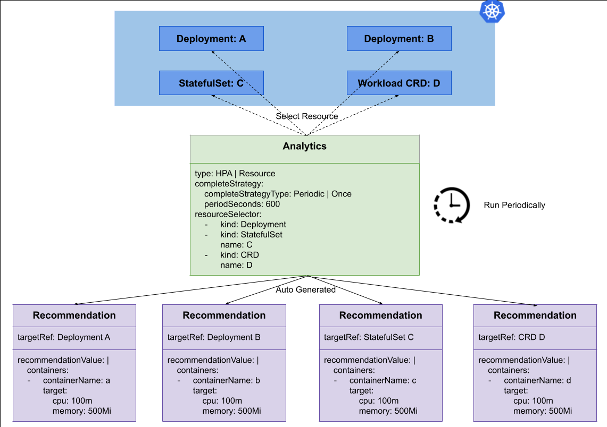

# 智能推薦

智能推薦能夠幫助用戶自動分析集群並給出優化建議。就像手機助手一樣，智能推薦會定期的掃描、分析你的集群並給出推薦建議。目前，我們提供了兩種優化能力：

- [**資源推薦**](resource-recommendation.zh.md): 通過資源推薦的算法分析應用的真實用量推薦更合適的資源配置，您可以參考並採納它提升集群的資源利用率。
- [**副本數推薦**](replicas-recommendation.zh.md): 通過副本數推薦的算法分析應用的真實用量推薦更合適的副本和 EHPA 配置，您可以參考並採納它提升集群的資源利用率。

應用可以根據資源推薦調整 request 也可以根據副本數推薦調整副本數，這兩種優化都能幫助您降低成本，您可以根據您的需求選擇採用相應的優化建議。

## 架構

## 一次分析的過程

1. 用戶創建 Analytics 對象，通過 ResourceSelector 選擇需要分析的資源，支持選擇多類型（基於Group,Kind,Version）的批量選擇
2. 並行分析每個選擇的資源，嘗試進行分析推薦，每次分析過程分成篩选和推薦兩個階段：
   1. 篩選：排除不滿足推薦條件的資源。比如對於彈性推薦，排除沒有 running pod 的 workload
   2. 推薦：通過算法計算分析，給出推薦結果
3. 如果通過篩選，創建 Recommendation 對象，將推薦結果展示在 Recommendation.Status
4. 未通過篩選的原因和狀態展示在 Analytics.Status
5. 根據運行間隔等待下次分析

## 名詞解釋 

### 分析

分析定義了一個掃描分析任務。支持兩種任務類型：資源推薦和彈性推薦。 Crane 定期運行分析任務，並產生推薦結果。

### 推薦

推薦展示了一個優化推薦的結果。推薦的結果是一段 YAML 配置，根據結果用戶可以進行相應的優化動作，比如調整應用的資源配置。

### 參數配置

不同的分析採用不同的計算模型，Crane 提供了一套默認的計算模型以及一套配套的配置，用戶可以通過修改配置來定制推薦的效果。支持修改全局的默認配置和修改單個分析任務的配置。